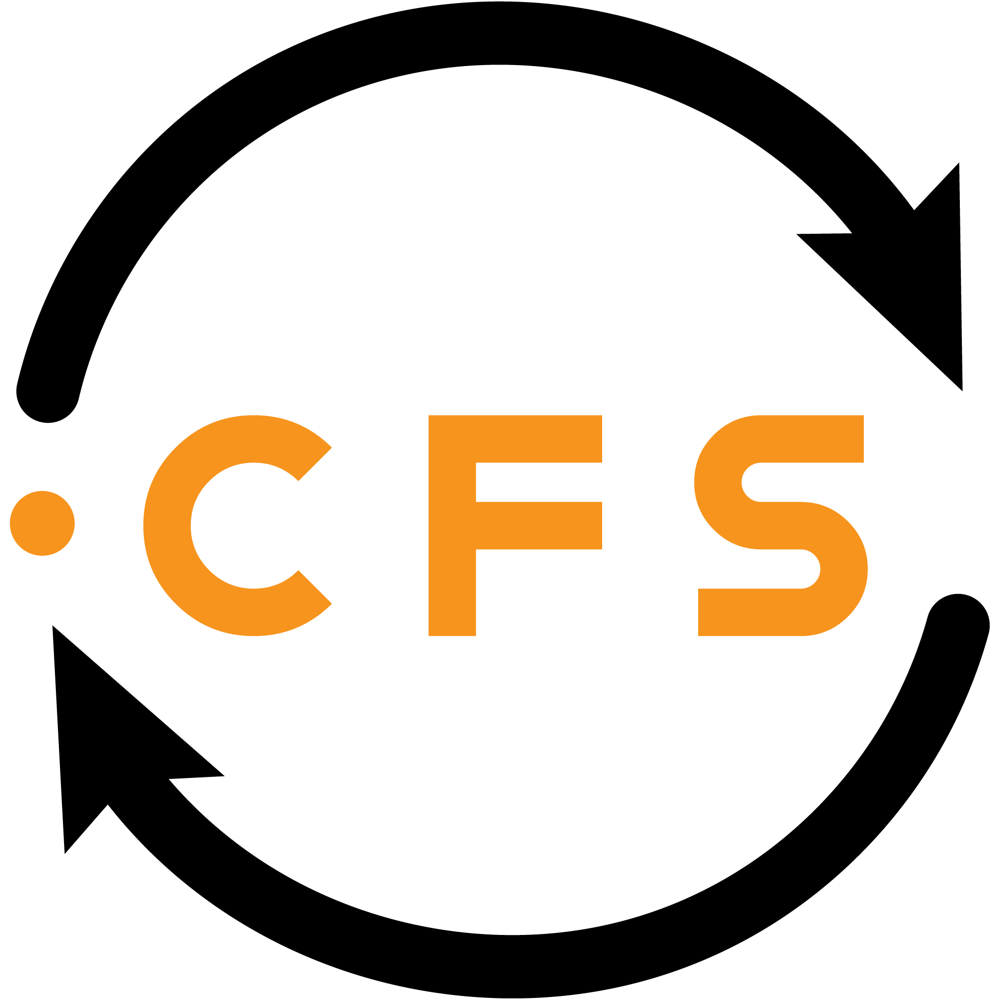

  

    

# Maintenance

I'm in need of someone to pass the mantle to. I'd love for this project to keep going, but I'm not currently able to give this the attention it deserves. I'm willing to help out and ease the transition to whoever wants to take it over.

# Introduction

When using Canvas, I found that constantly downloading new files, updated files and then organizing those files was a huge pain. This program aims to work by having Google Drive like functionality with Canvas so that you never have to worry about being up to date or how you have organized things, because they will be organized on your computer just as they are organized on Canvas.

[Canvas File Sync Site](https://canvasfilesync.com)

## Running this code

Clone this repository and run `yarn`. Once it's done installing the modules, run `yarn run dev`

## Building this code

`yarn run build:mac`

`yarn run build:win`

### Note

Releases are being code signed so your personal build will not work with the built in autoupdating.

## Contributing

I'd appreciate any help that anyone would like to give and have included draw.io diagrams in the diagrams folder to help facilitate understanding of the overall flow. 

## TODO
- [x] Toggle courses to sync
- [x] Increase initial download speed
- [x] Handle situations more gracefully where an update has occurred both locally and remotely
- [ ] Allow more granular control of what to sync(Treeview)
